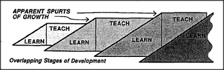

# 17.1 SEQUENCES OF TEACHING-SELVES 

Up to this point we've portrayed the mind as made of scattered fragments of machinery. But we adults rarely see ourselves that way; we have more sense of unity. In the next few sections we'll speculate that this coherency is acquired over many <em>stages of development.</em> Each new stage first works under the guidance of previous stages, to acquire some knowledge, values, and goals. Then it proceeds to change its role and becomes a teacher to subsequent stages.

<figure></figure>

How could an early stage teach anything to a later one when it knows less than its student does? As every teacher knows, this is not as hard as it might seem. For one thing, it is usually easier to recognize a solution to a problem than to discover a solution; this is what we called the <em>puzzle principle.</em> A teacher need not know how to solve a problem to be able to reward a student for doing so or to help the student search for solutions by imparting ways to sense when progress has been made. Even better is for the teacher to impart new goals to the student.

How could an early stage of development affect the goals of a later stage? One simple way would be to give each later stage some access to the goals of earlier stages; however, those early goals would then remain infantile. How could later stages develop more advanced goals? Shortly we'll see an astonishing answer: it is not necessary to formulate more advanced goals at <em>higher levels</em> of organization because they are likely to develop spontaneously, as subgoals of relatively simple goals.

In any case, it wouldn't be safe to send the student into the world equipped with systems that have not yet been tried and tested. A safer strategy would be to keep each new stage suppressed &mdash; that is, incapable of controlling the child's actual behavior &mdash; until it passes tests to verify that it is at least as capable as its predecessor. This could explain some of those apparently sudden <em>spurts</em> in our children's development &mdash; for example, in episodes of rapid growth of language skills. That apparent speed could be illusory if it were merely the end result of longer, hidden projects carried out silently inside the mind.

Returning to our sense of Self, how could so many steps and stages lead to any sense of unity? Why wouldn't they lead us, instead, to feel increasingly fragmentary and dispersed? I suspect the secret is that after each old stage's work is done, its structure still remains available for further use. These remnants of our prior selves provide us with a powerful resource: whenever one's present mind gets confused, it can exploit what once was used by earlier minds. Even though we weren't as smart then as we are now, we can be sure that every stage once had, in its turn, some workable ways to manage things.

One's present personality cannot share many of the thoughts of all one's older personalities &mdash; and yet it has some sense that they exist. This is one reason why we feel that we possess an inner Self &mdash; a sort of ever-present person-friend, inside the mind, whom we can always ask for help.
