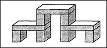

# 20.3 VISUAL AMBIGUITY 

<h2><em>20.3</em> visual ambiguity</h2>

We usually think of <em>ambiguity</em> as an aspect of language &mdash; but ambiguities are just as common in vision, too. What's that structure shown below? It could be regarded as nine separate blocks, as an arch supported by two other arches, or as a single, complicated, nine-block arch!

<figure></figure>

What process makes us able to see that superarch as composed of three little arches rather than of nine separate blocks? How, for that matter, do we recognize those as blocks in the first place, instead of seeing only lines and corners? These <em>ambiguities</em> are normally resolved so quickly and quietly that our higher-level agencies have no sense of conflict at all. To be sure, we sometimes have the sense of perceiving the same structure in several ways at once &mdash; for example, as both a single complex arch and as three separate simpler arches. But we usually lock in on one particular interpretation.

Sometimes no lower-level information can resolve an ambiguity &mdash; as in the case of this example by Oliver Selfridge.

Here, there is no difference whatever between the H and the A, yet we see them as having distinct identities in their different contexts. Evidently, the <em>simulus</em> produced by the visual sense is strongly affected by the state of some language-related agency. Furthermore, just as we can describe the same figure in different ways, we often can describe different figures in the same way. Thus, we recognize all these figures as similar, though no two of them are actually the same:

If we described each of these in terms of the lengths, directions, and locations of their lines, they would all seem very different. But we can make them all seem much the same by describing each of them in the same way, perhaps like this: <em>a triangle with two lines extended from one of its vertices.</em> The point is that what we <em>see</em> does not depend only on what reaches our eyes from the outside world. The manner in which we interpret those stimuli depends to a large extent on what is already taking place inside our agencies.
